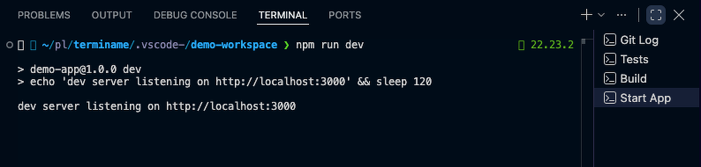

# Terminame

Names your terminal tabs after what is running in them. `npm run dev` becomes **Start App**,
`git rebase -i main` becomes **Rebase**, `pytest tests/api` in `packages/billing` becomes **Billing Tests**.

Works on install with zero configuration, in Cursor and VS Code.



## Install

Search for **Terminame** in the Extensions view, or install from the store for your editor:

- **VS Code:** [Visual Studio Marketplace](https://marketplace.visualstudio.com/items?itemName=GalEzra.terminame), or `code --install-extension GalEzra.terminame`
- **Cursor and other VS Code forks:** [Open VSX](https://open-vsx.org/extension/GalEzra/terminame), or `cursor --install-extension GalEzra.terminame`

To install from a file instead, grab `terminame-<version>.vsix` from the [latest release](https://github.com/galezra/terminame/releases/latest) and run **Extensions: Install from VSIX...** from the command palette. `npm install && npm run package` in a clone produces the same file (needs Node 20+).

Reload the window once after installing.

## How names are chosen

1. **Editor model** — if your editor exposes one (VS Code with Copilot). Not available in Cursor.
2. **Claude Code CLI** — if `claude` is installed and you have run `/login`. Terminame only runs the
   binary; it never reads your credentials.
3. **Anthropic SDK** — if the SDK can find credentials on its own (`ANTHROPIC_API_KEY`, an
   `ant auth login` profile) or you set a key via *Terminame: Set Anthropic API key*.
4. **Built-in rules** — always available, instant, offline.

A command the shell cannot find (exit code 127, `command not found`) is skipped: no model call, and the tab keeps the name it had.

Answers are cached per command **and folder**, so each distinct command in a given folder costs one model call.

A status-bar item reading "Terminame: rules" appears when auto-detection found no model and Terminame is naming tabs from rules alone. Click it to open the log. It stays hidden when a model provider is in use, or when you set `terminame.provider` to `rules` yourself.

## Commands

| Command | What it does |
|---|---|
| *Terminame: Rename current terminal now* | Prompts for a command and names the active terminal after it. Also takes back a tab you had renamed by hand |
| *Terminame: Clear name cache* | Empties the cached command → name map |
| *Terminame: Show log* | Opens the Terminame output channel |
| *Terminame: Set Anthropic API key* | Stores a key in SecretStorage for the Anthropic SDK provider (submit an empty value to delete it) |

## Settings

| Setting | Default | What it does |
|---|---|---|
| `terminame.enabled` | `true` | Master switch |
| `terminame.mode` | `instant` | Rules name at once, then the model name when it answers. `waitForModel` waits for the model |
| `terminame.timeoutMs` | `20000` | Model timeout |
| `terminame.provider` | `auto` | Force `vscodeLm`, `claudeCli`, `anthropic`, or `rules` |
| `terminame.anthropic.model` | `claude-haiku-4-5` | Model for the SDK provider |
| `terminame.rules` | `[]` | Your own `{ "match": "make deploy*", "name": "Deploy" }` rows, checked first. `*` matches anything; `<host>` captures one word |
| `terminame.ignore` | `[]` | Extra commands that never rename. Matched against the **first word only** (`make`, not `make lint`) |
| `terminame.idleName` | `keep` | `folder` or `shell` to revert when the command ends |
| `terminame.aggressiveRename` | `false` | **Experimental.** Focus background tabs to rename them right away (causes a flicker; not verified against the live VS Code API) |

## Known limits

- VS Code can only rename the **active** terminal, so a background tab is renamed the moment you click it.
- Requires terminal shell integration (on by default for zsh, bash, fish, PowerShell).
- If you rename a tab yourself, Terminame leaves it alone until it is closed. One exception: a tab you rename by hand *before* Terminame has ever named it, while it is not the active tab, can be overwritten once by the first queued rename.
- **Windows:** the Claude Code CLI lookup does not append `.exe`, so that provider is skipped and Terminame falls back to the editor model, the Anthropic SDK, or rules.

## Troubleshooting

**Nothing happens.** Run *Terminame: Show log*. Every command should produce a `start` line, an `end` line, and a `→` line with the chosen name. No `start` line means the editor never reported the command: hover the terminal tab and check that shell integration is active.

**Nothing happens, or only the first command in each terminal gets a name, and the tab tooltip says "Shell integration: Injection failed to activate".** Some terminal tools (autocomplete wrappers, shell launchers) start their own shell inside the editor terminal, and that shell never loads the editor's injected shell-integration file. Load it yourself from `~/.zshrc`:

```zsh
# VS Code / Cursor shell integration. Must run before your prompt theme loads.
if [[ "$TERM_PROGRAM" == "vscode" && -z "$VSCODE_SHELL_INTEGRATION" ]]; then
  unset VSCODE_INJECTION
  for __editor in cursor code; do
    command -v "$__editor" >/dev/null 2>&1 && . "$("$__editor" --locate-shell-integration-path zsh)" && break
  done
  unset __editor
fi
```

Place it near the top of the file, before your prompt theme and before any tool that wraps the shell. Prompt themes that rebuild the prompt on every command emit the editor's markers only when `VSCODE_SHELL_INTEGRATION` is set at the time they load; with this block at the bottom of `.zshrc`, the first command in each terminal is reported and every later one is dropped. Open a new terminal afterwards, existing terminals keep the old shell.

**Names come from rules only.** The status-bar item "Terminame: rules" means no model provider was found. Install Claude Code and run `/login`, sign in to Copilot, or set an Anthropic key. A model call that exceeds `terminame.timeoutMs` also falls back to a rules name; three misses in a row disable that provider for the session.

## Known issues

- Model answers ending in a balanced `)` or `]` lose the closing bracket ("Tests (api)" becomes "Tests (api").
- With `idleName` set to `folder` or `shell` and mode `waitForModel`, a command that finishes before the model answers still ends up with the model's name.
- `terminame.aggressiveRename` is experimental: not verified against the live editor API, and it can steal focus mid-typing.

## Development

Requires Node 20+.

    npm install
    npm run build        # bundle to dist/
    npm test             # unit tests (Vitest)
    npm run test:ext     # extension-host smoke tests (downloads a VS Code build on first run)
    npm run package      # build a .vsix

### Releasing

Bump `version` in `package.json`, add the changelog entry, merge to `main`, then tag and push:

    git tag v0.1.1 && git push origin v0.1.1

The Publish workflow builds the `.vsix`, attaches it to a GitHub release, and publishes it to each store whose token is present as a repository secret: `VSCE_PAT` (Azure DevOps personal access token with Marketplace *Manage* scope) for the Visual Studio Marketplace, `OVSX_PAT` (Open VSX access token) for Open VSX. A missing secret skips that store; upload the `.vsix` from the release by hand instead.

`docs/` holds the original design spec and implementation plan.
